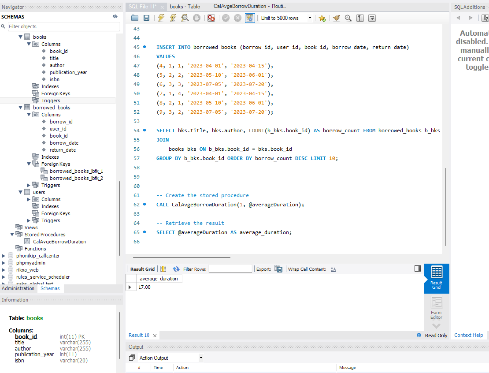

#### Test Questions and answers
Q1. Write a SQL query to retrieve the top 10 most borrowed books, along with the number of times each book has been borrowed.

Ans. 
```db2
   SELECT bks.title, bks.author, COUNT(b_bks.book_id) AS borrow_count FROM borrowed_books b_bks
JOIN
    books bks ON b_bks.book_id = bks.book_id
GROUP BY b_bks.book_id ORDER BY borrow_count DESC LIMIT 10;
```
Q2.Create a stored procedure that calculates the average number of days a book is borrowed before being returned. The procedure should take a book_id as input and return the average number of days.

Ans.
```db2
DELIMITER //

CREATE PROCEDURE CalAvgeBorrowDuration(IN bookId INT, OUT avgDuration DECIMAL(10,2))
BEGIN
    SELECT AVG(DATEDIFF(return_date, borrow_date)) INTO avgDuration
    FROM borrowed_books
    WHERE book_id = bookId AND return_date IS NOT NULL;
END //

DELIMITER ;
```


Q3.Write a query to find the user who has borrowed the most books from the library.

Ans.
```db2
SELECT u.user_id, u.first_name, u.last_name, COUNT(b_bks.borrow_id) AS books_borrowed 
FROM users u
JOIN
    borrowed_books b_bks ON u.user_id = b_bks.user_id
GROUP BY u.user_id ORDER BY books_borrowed DESC LIMIT 1;
```
Q4.Create an index on the publication_year column of the books table to improve query performance.

Ans.
```db2
CREATE INDEX idx_publication_year ON books(publication_year);
```
Q5.Write a SQL query to find all books published in the year 2020 that have not been borrowed by any user.

Ans.
```db2
SELECT bks.book_id, bks.title, bks.author, bks.publication_year  
FROM books bks
LEFT JOIN borrowed_books b_bks ON bks.book_id = b_bks.book_id
WHERE bks.publication_year = 2020 AND b_bks.borrow_id IS NULL;
```
Q6.Design a SQL query that lists users who have borrowed books published by a specific author (e.g., "J.K. Rowling").

Ans.
```db2
SELECT u.* FROM users u
JOIN borrowed_books b_bks ON u.user_id = b_bks.user_id
JOIN books bks ON b_bks.book_id = bks.book_id
WHERE bks.author = 'J.K. Rowling';
```

Q7.Create a trigger that automatically updates the return_date in the borrowed_books table to the current date when a book is returned.

Ans.
```db2
DELIMITER //

CREATE TRIGGER update_return_date
BEFORE UPDATE ON borrowed_books
FOR EACH ROW
BEGIN
    IF NEW.return_date IS NOT NULL THEN
        SET NEW.return_date = CURRENT_DATE;
    END IF;
END //

DELIMITER ;
```
