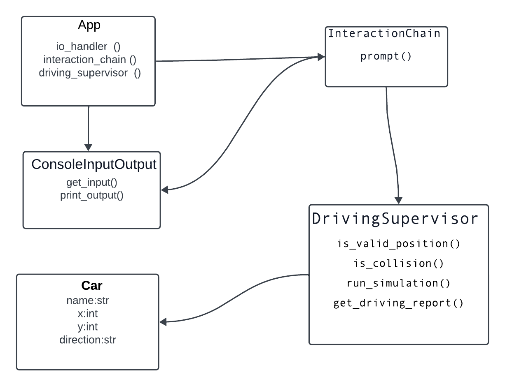
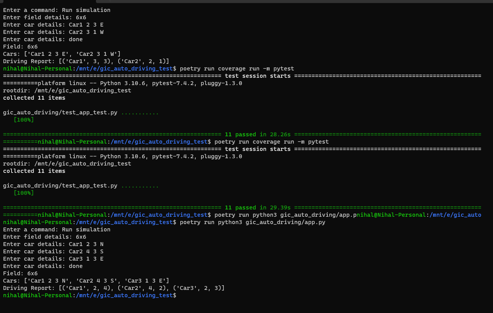

# Auto driving

## Design



Split app for 2 parts - interaction & core

Interaction is for user input handling, interaction_chain.prompt is the start function to guide user's input
Core is for auto driving simulation,

Encapsulate input/print into ConsoleInputOutput so that can test I/O easily,
App will initial ConsoleInputOutput and provide to interaction chain, and app will add on_run_simulation event
to interaction chain when User selects "Run simulation" command will pass InputField & InputCars to APP, and then APP
will give these DTOs to Driving Supervisor and supervisor will initial field & cars for running simulation.
After running simulation App can get driving report from Supervisor and via ConsoleInputOutput print into console.

## Demo



## Project explanation

### build tool:

  Using [poetry](https://python-poetry.org/) to manage dependencies & build application.

#### dependencies:

| lib name    | purpose            |
|-------------|--------------------|
| pytest      | unit test          |
| pytest-mock | unit test mock     |
| coverage    | unit test coverage |
| black       | code formatter     |
| flake8      | lint tool          |

### Running app

#### Testing assumption
   1. If initial car position out of field, should not execute any commands.
   2. If initial car's name existing, the new car will replace existing car.
   3. If initial cars are in the same position which means these cars which in the same position are collision already, 
      so should not execute any commands.
   4. Direction definition:
   
        ``` text
                   ↑ North
         ← West                 → East
                   ↓ South

         N turn left should be W, turn right should be E
         E turn left should be N, turn right should be S
         S turn left should be E, turn right should be W
         W turn left should be S, turn right should be N
        ```
      

#### Tested on Windows11, MacOS13.4.1, Ubuntu 18.04 LTS

1. Setup:
   1. Please make sure the running OS has Python version of 3.9 or higher.
   2. Please install poetry.
      ```shell
         curl -sSL https://install.python-poetry.org | python3 -
      ```
   3. Please install dependencies using below command:
      ```shell
         poetry install
      ```

2. Running App (in project root folder):
   ```shell
      poetry run python3 gic_auto_driving/app.py
   ```
3. Running Unit test
   ```shell
      poetry run coverage run -m pytest
   ```
